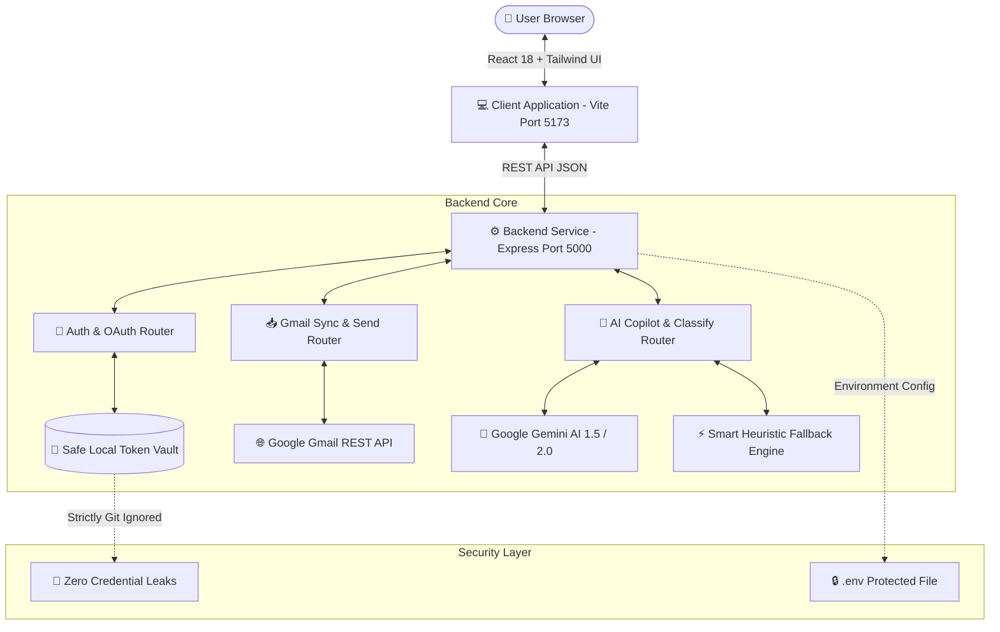

# ⚡ Copmail — Copilot+Mail — Your Intelligent AI Email Workspace for Understanding, Organizing, Automating, and Acting on Every Message.

[](https://www.typescriptlang.org/)
[](https://react.dev/)
[](https://vitejs.dev/)
[](https://tailwindcss.com/)
[](https://ai.google.dev/)
[](https://developers.google.com/identity/protocols/oauth2)
[](LICENSE)

> **Tame inbox overload in seconds.** Copmail is an intelligent, privacy-first AI personal assistant for Gmail. It automatically categorizes incoming emails, crafts human-like replies in your chosen tone, extracts buried deadlines and action items, and summarizes 50-email threads into 3 crisp bullet points — **all without ever modifying your Gmail labels or sending messages without your explicit confirmation.**

---

## 🌟 What Problem Does Copmail Solve?

Have you ever opened your inbox on a Monday morning to **150 unread emails** and felt completely lost?

* 😫 **The Old Way**: You spend 2 hours reading walls of text, scrolling back and forth to find dates or attachments, writing the same polite replies over and over, and accidentally missing important client tasks buried under marketing newsletters.
* 🚀 **The Copmail Way**: Copmail acts like a brilliant executive assistant sitting right next to you:
  1. **Instant Clarity**: Glance at your inbox and immediately see color-coded tags like **Work**, **Finance**, or **Important** with AI confidence ratings.
  2. **3-Second Catch-Up**: Open any long thread and read a 3-bullet executive summary instead of 20 paragraphs.
  3. **One-Click Replies**: Copmail drafts an empathetic, polite, and context-aware reply for you in your choice of tone (Professional, Friendly, Concise).
  4. **Never Miss a Task**: Action items, assignees, and deadlines are automatically extracted into a clean checklist.
  5. **You Stay in Control**: You can edit the draft, review everything, and click Send. Nothing is ever sent automatically without your say-so.

---

## 🚀 Key Features Explained (In Plain English)

### 1. 🏷️ AI-Powered Smart Inbox Categorization
Instead of mixing urgent bills with promotional spam, Copmail's AI engine classifies every email into one of 7 standard categories:
* **Important**: Urgent updates, escalations, security alerts, high-value inquiries.
* **Work**: Team collaboration, client discussions, project milestones, code reviews.
* **Personal**: Messages from family, friends, personal invitations.
* **Finance**: Invoices, receipts, bank statements, tax documents, subscription renewals.
* **Promotions**: Discounts, marketing campaigns, newsletters, sales offers.
* **Notifications**: Automated system alerts, CI/CD builds, GitHub updates, shipping tracking.
* **Other**: General miscellanea that doesn't fit the above buckets.

> **Privacy Guarantee**: Copmail's categorization is strictly non-destructive. It computes smart tags in memory with dual-tier caching (server + client) and **never modifies, scrambles, or deletes labels in your actual Gmail account**.

---

### 2. ⚡ Executive Thread Summaries
Don't waste 15 minutes reading a 12-reply back-and-forth email chain. Copmail produces:
* A 2-sentence executive summary.
* Key discussion takeaways in bullet points.
* Explicit notice of whether action is required from you.
* Estimated reading time and deadlines.

---

### 3. ✍️ Context-Aware AI Draft Replies with Tone Styler
Staring at a blank reply box wondering how to respond? Copmail analyzes the entire conversation history and crafts a ready-to-send draft.
* **Choose Your Tone**:
  * 👔 **Professional** (Polite, structured, corporate-friendly)
  * 😊 **Friendly** (Warm, approachable, conversational)
  * 🏛️ **Formal** (Respectful, executive, thorough)
  * ☕ **Casual** (Lighthearted, brief, collegial)
  * ⚡ **Concise** (Straight to the point, zero fluff)
  * 🎯 **Persuasive** (Compelling, value-focused, call-to-action driven)
* **One-Click Insert**: Click **"Insert from Copilot"** to instantly paste the generated response directly into the inline composer. Edit any word you want before hitting Send.

---

### 4. 📋 Action Item & Deadline Extraction
Buried halfway through a 500-word email is a sentence: *"Please send the updated budget spreadsheet by Thursday 3 PM."*
* Copmail detects tasks automatically.
* Extracts the **task description**, **detected assignee**, **urgency level (High/Medium/Low)**, and **deadline date**.
* Displays a neat, actionable checklist right in your Copilot side pane.

---

### 5. 🎯 Smart Priority & Urgency Triage
Copmail flags whether an incoming email is:
* 🔴 **URGENT**: Needs immediate attention (within 1–2 hours).
* 🟠 **HIGH**: Important decision or client response needed today.
* 🔵 **NORMAL**: Standard communication, reply within 24–48 hours.
* ⚪ **LOW**: Informational / read at your leisure.

---

### 6. 💬 Interactive "Ask Copilot" Q&A
Have a specific question about an email thread? Type anything into the Copilot chat:
* *"Did Alex agree to the proposed timeline?"*
* *"What was the zoom link they sent earlier?"*
* *"How much was the invoice total?"*
Copmail answers with grounded citations directly from the email body.

---

### 7. 🔒 Safe Live Gmail Sync & Real RFC 2822 Sending
* **Official Google OAuth 2.0**: Connect securely via Google's consent screen. Offline token storage with automatic access token refreshing.
* **Direct Send**: Sends real emails via Gmail's standard RFC 2822 standard (`messages.send`).
* **Human-in-the-Loop**: Copmail will **NEVER** autonomously send emails. Every outgoing message requires your direct manual confirmation.

---

### 8. 🎭 Instant Interactive UI Preview Mode
Don't want to connect your real Gmail account yet? No problem! Copmail includes a built-in **Preview Mode** loaded with realistic email datasets (client contracts, server outage alerts, coffee catch-ups, travel confirmations) so you can test all features immediately without entering any credentials.

---

## 🏗️ System Architecture



---

## 🛠️ Technology Stack

| Layer | Technologies Used | Purpose |
| :--- | :--- | :--- |
| **Frontend** | React 18, TypeScript, Vite 6, Tailwind CSS, Lucide Icons | Responsive, ultra-fast 3-pane email interface |
| **Backend** | Node.js, Express 4, TypeScript, tsx | RESTful API server, token vault, request orchestration |
| **AI Intelligence** | Google GenAI SDK (`@google/genai`), Gemini 2.0 Flash | Thread summarization, classification, draft replies |
| **Google Cloud** | Googleapis (`v178`), Google OAuth 2.0 PKCE | Secure user authentication, Gmail thread sync, RFC 2822 send |
| **Utilities** | Concurrently, Dotenv, CORS | Multi-process development runner, config management |

---

## 📂 Project Structure

```
gmail-copilot/
├── client/                     # Frontend Application (React + Vite + Tailwind)
│   ├── src/
│   │   ├── components/
│   │   │   ├── copilot/        # AI Copilot hub, action cards, Q&A chat
│   │   │   ├── inbox/          # Email thread list, category badges, unread state
│   │   │   ├── layout/         # Header, folder navigation sidebar, connection status
│   │   │   ├── modals/         # New message composer, OAuth connection modal
│   │   │   └── reading-pane/   # Thread message viewer, inline reply composer
│   │   ├── data/               # Realistic preview datasets for zero-config testing
│   │   ├── services/           # Axios/Fetch API client communicating with backend
│   │   ├── types/              # Client TypeScript models & schemas
│   │   ├── App.tsx             # Root state orchestrator & batch categorization hooks
│   │   └── main.tsx            # React application entry point
│   ├── package.json
│   └── vite.config.ts
│
├── server/                     # Backend API Server (Node + Express + TypeScript)
│   ├── src/
│   │   ├── routes/
│   │   │   ├── ai.routes.ts    # AI summarization, categorization, draft replies
│   │   │   ├── auth.routes.ts  # Google OAuth login, callback, status, logout
│   │   │   └── gmail.routes.ts # Thread listing, message details, RFC 2822 send
│   │   ├── services/
│   │   │   ├── ai.service.ts   # Gemini prompt orchestration & heuristic fallbacks
│   │   │   ├── auth.service.ts # Google OAuth 2.0 client & token refresh
│   │   │   ├── classification.service.ts # Smart Inbox categorization & caching
│   │   │   ├── gmail.service.ts# Gmail API thread parser & raw message builder
│   │   │   └── token.store.ts  # Safe local file-based token storage
│   │   ├── types/              # Backend DTOs & response schemas
│   │   ├── utils/              # Email HTML/Plaintext cleaners & normalizers
│   │   ├── config.ts           # Type-safe environment variable loader
│   │   └── index.ts            # Express application bootstrap & CORS setup
│   ├── package.json
│   └── tsconfig.json
│
├── .env.example                # Safe environment variable template
├── .gitignore                  # Security rules preventing any secret leaks
├── package.json                # Root workspace scripts (run both client & server)
└── README.md                   # Comprehensive project documentation
```

---

## ⚡ Quick Start & Setup Guide (5 Minutes)

Follow these simple steps to run Copmail locally on your machine.

### Step 1: Prerequisites
Ensure you have the following installed:
* [Node.js](https://nodejs.org/) (Version 18 or higher)
* [npm](https://www.npmjs.com/) (Version 9 or higher)
* A Google Account (for OAuth / Gmail connection)

---

### Step 2: Clone & Install Dependencies
Open your terminal or command prompt:

```bash
# Clone the repository
git clone https://github.com/Rakshan-19/COPMAIL-NEBULA-MAIL-WEB-APP.git
cd copmail

# Install all dependencies across root, server, and client with one command:
npm run install:all
```

---

### Step 3: Configure Environment Variables

1. Copy the template `.env.example` into a new file named `.env` in the root folder:

```bash
cp .env.example .env
```

*(On Windows PowerShell: `Copy-Item .env.example .env`)*

2. Open `.env` in your code editor. It looks like this:

```env
# Server Configuration
PORT=5000
NODE_ENV=development
CLIENT_URL=http://localhost:5173

# Google OAuth 2.0 Credentials
GOOGLE_CLIENT_ID=your_google_client_id_here
GOOGLE_CLIENT_SECRET=your_google_client_secret_here
GOOGLE_REDIRECT_URI=http://localhost:5000/api/auth/google/callback

# Gemini AI Configuration
GEMINI_API_KEY=your_gemini_api_key_here
LLM_MODEL=gemini-1.5-flash

# Security Session Secret
SESSION_SECRET=a_random_secure_32_character_string_here
```

---

### Step 4: Getting Your Free API Keys

#### A. Google OAuth Credentials (for Live Gmail Sync & Sending)
1. Go to [Google Cloud Console](https://console.cloud.google.com/).
2. Create a new project (e.g., `copmail-app`).
3. In the left sidebar, navigate to **APIs & Services > Library**.
4. Search for **Gmail API** and click **Enable**.
5. Go to **APIs & Services > OAuth consent screen**:
   * Choose **External**, then click **Create**.
   * Fill in the App name (`Copmail`) and your email address.
   * Under **Test users**, add your own Gmail address (e.g., `yourname@gmail.com`).
6. Go to **APIs & Services > Credentials**:
   * Click **+ CREATE CREDENTIALS** > **OAuth client ID**.
   * Application type: **Web application**.
   * Name: `Copmail Web Client`.
   * Under **Authorized redirect URIs**, click **+ ADD URI** and enter:
     `http://localhost:5000/api/auth/google/callback`
   * Click **Create**.
7. Copy your **Client ID** and **Client Secret** into your `.env` file.

#### B. Google Gemini API Key (for AI Summaries & Drafts)
1. Visit [Google AI Studio](https://aistudio.google.com/).
2. Click **Get API key** and create a new key.
3. Paste the key into `GEMINI_API_KEY` in your `.env` file.

> **Note**: Even if you do not set a Gemini API key immediately, Copmail includes an intelligent built-in heuristic fallback engine, allowing you to test all UI and email features seamlessly!

---

### Step 5: Start the Development Servers

From the root directory, simply run:

```bash
npm run dev
```

This starts both servers simultaneously:
* 🌐 **Frontend**: `http://localhost:5173`
* ⚙️ **Backend**: `http://localhost:5000`

Open `http://localhost:5173` in your browser and experience your new AI Email Copilot!

---

## 🔒 Security & Privacy Policy

* **Credential protection**:Authentication tokens and private secrets are stored on the backend and excluded from version control through .gitignore. They are not exposed to the browser.
* **Read-Only Categorization**: Categorizing your emails does not alter, add, or delete Gmail labels in your real account.
* **Human-in-the-Loop Sending**: AI never sends emails autonomously. You have complete control to edit drafts and click "Send".
* **Revocable Access**: You can disconnect your Google Account at any time directly from the top-right header with a single click.

---

## 📜 Available NPM Scripts

* `npm run dev`: Runs both the frontend and backend in parallel with colored logs.
* `npm run dev:client`: Runs the Vite frontend development server on port 5173.
* `npm run dev:server`: Runs the backend API server on port 5000 with auto-reloading (`tsx watch`).
* `npm run build`: Type-checks and compiles both client and server for production.
* `npm run install:all`: Installs all dependencies across the workspace.

---

## 🤝 Contributing

Contributions, issues, and feature suggestions are always welcome!
1. Fork the repository.
2. Create your feature branch (`git checkout -b feature/amazing-feature`).
3. Commit your changes (`git commit -m 'Add amazing feature'`).
4. Push to the branch (`git push origin feature/amazing-feature`).
5. Open a Pull Request.

---

## 📄 License

This project is licensed under the **MIT License** — see the [LICENSE](LICENSE) file for details.

---

<p align="center">
  Built with ❤️ for a cleaner, stress-free inbox.
</p>
