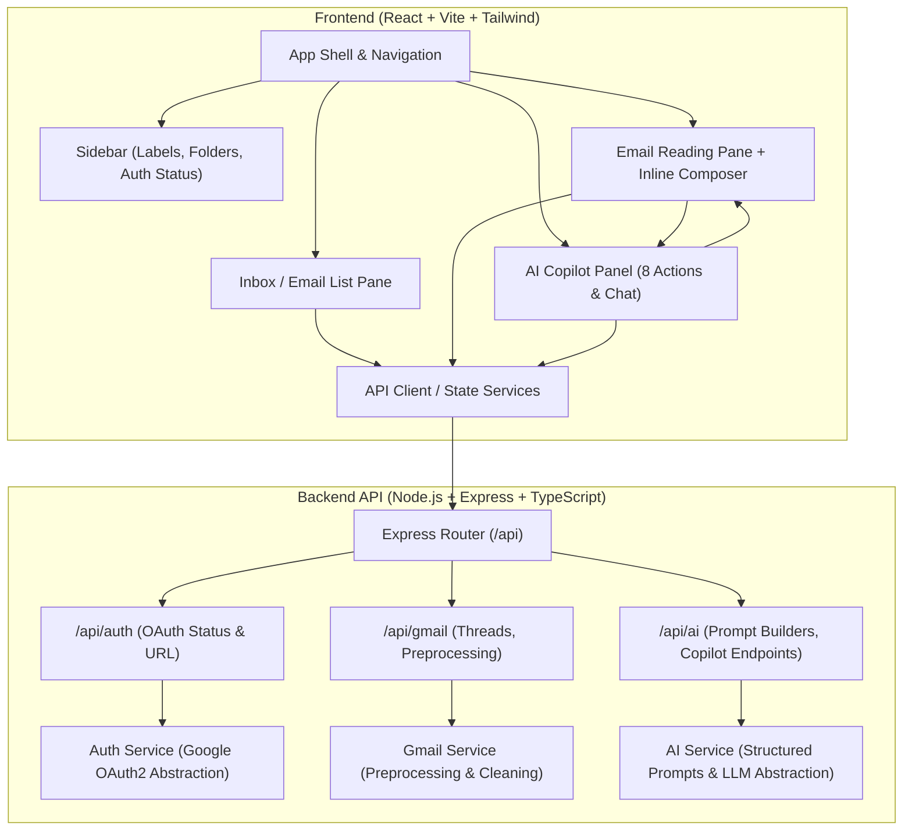

# Implementation Plan - AI Gmail Copilot (Stage 1)

Design and construct the foundational architecture and UI shell for the **AI Gmail Copilot** application according to the 26-step workflow, implementing **Stage 1 only**.

## User Review Required

> [!IMPORTANT]
> **Stage 1 Boundaries**: In this stage, we will establish the full architectural layout, frontend client, and backend API shell. We will **not** invoke real Google OAuth or real LLM calls yet, nor will we pretend to be connected.
> 
> The application will feature:
> 1. **Authentication Placeholder & State Machine**: Clearly displays whether the app is disconnected (requiring Google OAuth) or in "UI Preview / Demo Mode" (loaded with realistic sample threads to evaluate the UI interactions and Copilot actions).
> 2. **AI Copilot Panel**: Covers all 8 core actions (Summarize, Key Points, Action Items, Intent/Category, Draft Reply, Rewrite/Tone, Q&A Chat, and Natural Language Search) with complete state handling (Idle, Loading, Result, Accept/Edit, Insert into Composer).
> 3. **Clean Decoupled Architecture**: Frontend (React + TypeScript + Vite + Tailwind CSS + Lucide Icons) communicates with a Backend API (Node.js + Express + TypeScript) that provides strict boundaries, zero frontend secrets, and prepared abstractions for Google OAuth, Gmail API, and LLM providers.

> [!NOTE]
> The workspace will be created in `C:\Users\rakshan\.gemini\antigravity\scratch\gmail-copilot`. You can later set this as your active workspace in Antigravity.

---

## Proposed Architecture

---

## Proposed Changes

### 1. Root & Workspace Setup
- Root `package.json` with scripts to concurrently run frontend and backend, or run either independently.
- `.env.example` defining environment variables (`PORT`, `GOOGLE_CLIENT_ID`, `GOOGLE_CLIENT_SECRET`, `GOOGLE_REDIRECT_URI`, `GEMINI_API_KEY` / LLM keys) with security guidelines.
- Clean `.gitignore` ensuring credentials and `.env` files are never tracked.

#### [NEW] `gmail-copilot/package.json`
#### [NEW] `gmail-copilot/.env.example`
#### [NEW] `gmail-copilot/.gitignore`
#### [NEW] `gmail-copilot/README.md`

---

### 2. Backend Service Shell (`server/`)
- Express server with TypeScript, CORS, JSON parsing, and structured route registration.
- **Auth Routes & Service**: Endpoints for checking OAuth status (`/api/auth/status`), generating OAuth URL (`/api/auth/url`), and token callback placeholder (`/api/auth/callback`).
- **Gmail Routes & Service**: Endpoints for thread listing (`/api/gmail/threads`), single thread details (`/api/gmail/threads/:id`), labels (`/api/gmail/labels`), and email preprocessing/cleaning pipeline (cleaning headers, stripping boilerplate signatures, converting HTML to clean readable text).
- **AI Routes & Service**: Endpoints matching all 8 AI Copilot actions with structured prompt templates:
  - `POST /api/ai/summarize`
  - `POST /api/ai/key-points`
  - `POST /api/ai/action-items`
  - `POST /api/ai/intent-category`
  - `POST /api/ai/draft-reply`
  - `POST /api/ai/rewrite`
  - `POST /api/ai/ask`
  - `POST /api/ai/search-query`
- Validations and structured schemas (Zod or TypeScript types) ready for Stage 2 & 3.

#### [NEW] `gmail-copilot/server/package.json`
#### [NEW] `gmail-copilot/server/tsconfig.json`
#### [NEW] `gmail-copilot/server/src/index.ts`
#### [NEW] `gmail-copilot/server/src/config.ts`
#### [NEW] `gmail-copilot/server/src/routes/auth.routes.ts`
#### [NEW] `gmail-copilot/server/src/routes/gmail.routes.ts`
#### [NEW] `gmail-copilot/server/src/routes/ai.routes.ts`
#### [NEW] `gmail-copilot/server/src/services/auth.service.ts`
#### [NEW] `gmail-copilot/server/src/services/gmail.service.ts`
#### [NEW] `gmail-copilot/server/src/services/ai.service.ts`
#### [NEW] `gmail-copilot/server/src/utils/cleaner.ts`
#### [NEW] `gmail-copilot/server/src/types/index.ts`

---

### 3. Frontend Application Shell (`client/`)
- Vite + React + TypeScript + Tailwind CSS with modern design styling:
  - Gmail-inspired layout with modern AI aesthetics (subtle borders, clean typography, badge chips, sleek dark/light neutral palette).
- **Top Header Bar**: Search input with Natural Language AI Search trigger, Google connection status indicator badge ("Disconnected" / "Connected"), Settings toggle, Demo Mode switcher.
- **Left Sidebar**:
  - Primary "Compose" action button
  - Folder navigation (Inbox, Starred, Sent, Drafts, Spam, Trash) with unread count chips
  - Custom Gmail labels section
  - Quick Copilot shortcuts & connection status widget
- **Center Inbox Thread List**:
  - Category tabs (Primary, Social, Updates, Promotions)
  - Bulk select, mark read/unread, refresh controls
  - Thread rows with star, sender name, subject, preview snippet, tag chips, attachment indicator, and relative timestamp
  - Empty / disconnected state illustration with explicit "Connect Google Account" CTA or "View UI Preview Data"
- **Reading Pane (Full Thread View)**:
  - Thread subject, categories, action bar (Reply, Reply All, Forward, Archive, Delete, Mark Unread)
  - Chronological message history with sender avatar, timestamp, recipient list
  - Cleaned email content rendering
  - Inline reply composer with an **"Insert from Copilot"** hook
- **Right AI Copilot Panel (The Core AI Hub)**:
  - Collapsible / expandable panel
  - **Quick Action Grid**:
    1. Summarize Thread (concise bullet / narrative summary)
    2. Extract Key Points (salient highlights)
    3. Identify Action Items (checklist with assignees & urgency tags)
    4. Detect Intent & Category (sentiment, urgency level, category chip)
    5. Draft Smart Reply (options: Formal, Friendly, Direct, Custom)
    6. Rewrite / Change Tone (professional, shorter, empathetic, executive)
  - **Conversational Copilot Tab**: Q&A chat interface to ask any natural language question about the thread (e.g., "What was agreed regarding the budget?", "When is the deadline?").
  - **Action Review**: Generated outputs have "Accept & Insert into Composer", "Edit", or "Copy" buttons.
- **Modals**:
  - `AuthModal`: Explains required Google OAuth scopes (`gmail.readonly`, `gmail.modify`, `gmail.compose`, `gmail.send`) and security architecture.
  - `ComposeModal`: Standalone compose window.

#### [NEW] `gmail-copilot/client/package.json`
#### [NEW] `gmail-copilot/client/vite.config.ts`
#### [NEW] `gmail-copilot/client/tsconfig.json`
#### [NEW] `gmail-copilot/client/tailwind.config.js`
#### [NEW] `gmail-copilot/client/postcss.config.js`
#### [NEW] `gmail-copilot/client/index.html`
#### [NEW] `gmail-copilot/client/src/main.tsx`
#### [NEW] `gmail-copilot/client/src/index.css`
#### [NEW] `gmail-copilot/client/src/App.tsx`
#### [NEW] `gmail-copilot/client/src/types/index.ts`
#### [NEW] `gmail-copilot/client/src/services/api.ts`
#### [NEW] `gmail-copilot/client/src/data/previewData.ts`
#### [NEW] `gmail-copilot/client/src/components/layout/Header.tsx`
#### [NEW] `gmail-copilot/client/src/components/layout/Sidebar.tsx`
#### [NEW] `gmail-copilot/client/src/components/inbox/EmailList.tsx`
#### [NEW] `gmail-copilot/client/src/components/inbox/EmailItem.tsx`
#### [NEW] `gmail-copilot/client/src/components/reading-pane/ReadingPane.tsx`
#### [NEW] `gmail-copilot/client/src/components/reading-pane/MessageCard.tsx`
#### [NEW] `gmail-copilot/client/src/components/reading-pane/ReplyComposer.tsx`
#### [NEW] `gmail-copilot/client/src/components/copilot/CopilotPanel.tsx`
#### [NEW] `gmail-copilot/client/src/components/copilot/ActionCard.tsx`
#### [NEW] `gmail-copilot/client/src/components/copilot/CopilotChat.tsx`
#### [NEW] `gmail-copilot/client/src/components/copilot/NLSearchModal.tsx`
#### [NEW] `gmail-copilot/client/src/components/modals/AuthModal.tsx`
#### [NEW] `gmail-copilot/client/src/components/modals/ComposeModal.tsx`

---

## Verification Plan

### Automated Verification
- Server build & type check: `npm run build` or `npx tsc --noEmit` in `server/`
- Client build & type check: `npm run build` in `client/`
- Backend health & endpoint check: verify server starts cleanly on port 5000 and responds to `/api/health` and `/api/auth/status`.

### Manual Verification
- Launch both backend (`npm run dev` in `server`) and frontend (`npm run dev` in `client`).
- Verify the entire 3-column dashboard layout (Sidebar, Inbox List, Reading Pane) and collapsible 4th column (Copilot Panel).
- Test unauthenticated / disconnected state: verify clear auth banner and OAuth dialog without mock pretense.
- Test preview mode: verify selecting email threads loads full conversation in the reading pane.
- Test all 8 Copilot actions: trigger each action, verify loading skeletons, formatted result cards, and the "Insert into Reply" action populating the composer.
- Test responsive resizing and smooth transitions.

---
