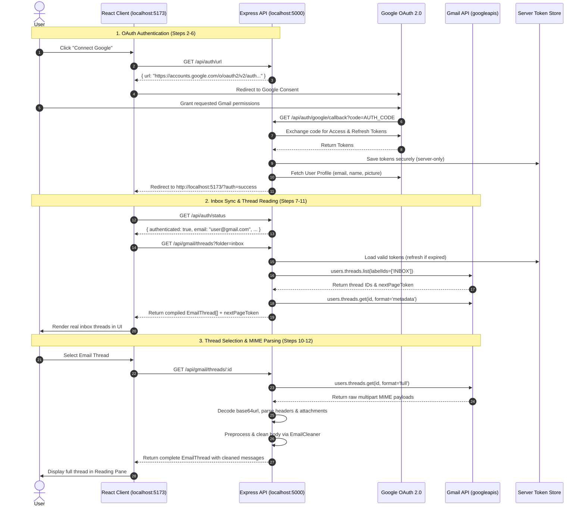

# Implementation Plan - AI Gmail Copilot (Stage 2: Real Google OAuth & Gmail API)

Transform the Stage 1 application shell into a real Gmail-connected application implementing **Workflow Steps 2–11**:
1. Google OAuth 2.0 authentication flow with official `googleapis` SDK.
2. Secure server-side token management (zero client-side tokens, replaceable storage interface).
3. Real Gmail API integration (`users.threads.list`, `users.threads.get`, `users.labels.list`).
4. MIME body parser & thread compiler supporting multipart, base64url decoding, and `EmailCleaner` pipeline.
5. Gmail label/folder mapping and pagination support (`nextPageToken`).
6. Frontend integration: live Gmail threads, real folder navigation, pagination, error handling, while preserving UI Preview Mode and Stage 1 Copilot layout.

---

## User Review Required

> [!IMPORTANT]
> **Google Cloud Setup Required for Live Verification**:
> To authenticate with a real Google account, you will need to:
> 1. Create/select a project on [Google Cloud Console](https://console.cloud.google.com/).
> 2. Enable the **Gmail API** in APIs & Services > Library.
> 3. Configure the **OAuth Consent Screen** with test users and the 4 scopes:
>    - `https://www.googleapis.com/auth/gmail.readonly`
>    - `https://www.googleapis.com/auth/gmail.modify`
>    - `https://www.googleapis.com/auth/gmail.compose`
>    - `https://www.googleapis.com/auth/gmail.send`
> 4. Create an **OAuth 2.0 Client ID (Web application)** with:
>    - Authorized Redirect URI: `http://localhost:5000/api/auth/google/callback`
> 5. Create a `.env` file in the project root containing your `GOOGLE_CLIENT_ID` and `GOOGLE_CLIENT_SECRET`.

> [!NOTE]
> **Security & Zero Leaks**:
> - Client secrets and access/refresh tokens **never** leave the backend.
> - No tokens are passed to React, stored in `localStorage`, or logged to stdout.
> - A pluggable `TokenStore` interface will store encrypted/secure local session tokens in `.tokens.json` (gitignored), ready for a database in future stages.

---

## Architecture & Data Flow

---

## Proposed Changes

### 1. Server Dependencies & Configuration
- Install `googleapis` in `server/package.json`.
- Add token storage path configuration in `server/src/config.ts`.
- Ensure `.gitignore` explicitly covers `.tokens.json`, `token*.json`, and `.env`.

#### [MODIFY] [`server/package.json`](file:///C:/Users/rakshan/.gemini/antigravity/scratch/gmail-copilot/server/package.json)
#### [MODIFY] [`server/src/config.ts`](file:///C:/Users/rakshan/.gemini/antigravity/scratch/gmail-copilot/server/src/config.ts)
#### [MODIFY] [`.gitignore`](file:///C:/Users/rakshan/.gemini/antigravity/scratch/gmail-copilot/.gitignore)

---

### 2. Secure Server-Side Token Handling (`server/src/services/token.store.ts`)
- Implement `ITokenStore` interface:
  - `getTokens(): Promise<Credentials | null>`
  - `saveTokens(tokens: Credentials): Promise<void>`
  - `clearTokens(): Promise<void>`
- `FileTokenStore` implementation: stores credentials in a server-side JSON file (`server/.tokens.json`), fully isolated from the frontend, with safe read/write locks.
- Pluggable design so it can be swapped with Redis, Postgres, or MongoDB later without altering Gmail or Auth services.

#### [NEW] [`server/src/services/token.store.ts`](file:///C:/Users/rakshan/.gemini/antigravity/scratch/gmail-copilot/server/src/services/token.store.ts)

---

### 3. Google OAuth 2.0 Implementation (`server/src/services/auth.service.ts` & `auth.routes.ts`)
- Use `google.auth.OAuth2` from `googleapis`.
- Configure client with `clientId`, `clientSecret`, `redirectUri`.
- Implement `generateAuthUrl()` with `access_type: 'offline'`, `prompt: 'consent'`, and the 4 Gmail scopes + userinfo.
- Implement `handleCallback(code)`:
  - Exchange code for tokens via `oauth2Client.getToken(code)`.
  - Save tokens into `TokenStore`.
  - Fetch user's profile info (`email`, `name`, `picture`) via `google.oauth2('v2').userinfo.get()`.
  - Listen for `'tokens'` event on `oauth2Client` to automatically persist refreshed tokens.
- Update `/api/auth/google/callback` route:
  - On success: redirects to `CLIENT_URL/?auth=success`.
  - On error: redirects to `CLIENT_URL/?auth=error&message=...`.
- Update `/api/auth/status`:
  - Returns authenticated state, user profile info, granted scopes, and mode (`live` vs `placeholder`).
- Implement `/api/auth/logout`:
  - Revokes tokens with Google if possible, clears `TokenStore`, and resets auth state.

#### [MODIFY] [`server/src/services/auth.service.ts`](file:///C:/Users/rakshan/.gemini/antigravity/scratch/gmail-copilot/server/src/services/auth.service.ts)
#### [MODIFY] [`server/src/routes/auth.routes.ts`](file:///C:/Users/rakshan/.gemini/antigravity/scratch/gmail-copilot/server/src/routes/auth.routes.ts)

---

### 4. MIME Parser & Thread Compiler (`server/src/utils/mime.ts`)
- Robust parser for Gmail messages (`gmail_v1.Schema$Message`):
  - Parse headers: extract `Subject`, `From`, `To`, `Cc`, `Bcc`, `Date`.
  - MIME traversal: recursively search message parts (`text/plain`, `text/html`, multipart alternatives/mixed).
  - Base64url decoder: decode body payloads safely with UTF-8 encoding.
  - Attachment extractor: identify parts with `filename` and `body.attachmentId`.
  - Clean body generation: pipe extracted body through `EmailCleaner.cleanContent()` for clean AI-ready text.
  - Thread compiler: deduplicate participants, determine overall unread/starred states, map categories (`CATEGORY_PERSONAL`, `CATEGORY_SOCIAL`, `CATEGORY_UPDATES`, `CATEGORY_PROMOTIONS`), sort messages chronologically.

#### [NEW] [`server/src/utils/mime.ts`](file:///C:/Users/rakshan/.gemini/antigravity/scratch/gmail-copilot/server/src/utils/mime.ts)

---

### 5. Gmail API Service (`server/src/services/gmail.service.ts` & `gmail.routes.ts`)
- Use `google.gmail({ version: 'v1', auth: oauth2Client })`.
- Implement `listThreads`:
  - Map UI folders (`inbox`, `starred`, `sent`, `drafts`, `spam`, `trash`) to Gmail `labelIds` or search queries.
  - Support user query filtering (`q`).
  - Support `maxResults` and `pageToken` for pagination.
  - Fetch metadata summaries to assemble lightweight thread previews for fast list rendering.
- Implement `getThreadById`:
  - Fetch complete thread with `format: 'full'`.
  - Compile full conversation using `MimeParser`.
- Implement `listLabels`:
  - Fetch system and user-created labels via `users.labels.list`.
  - Return name, ID, message count, and unread counts.
- Add route query parameter handling for `folder`, `q`, `pageToken`, `maxResults`.

#### [MODIFY] [`server/src/services/gmail.service.ts`](file:///C:/Users/rakshan/.gemini/antigravity/scratch/gmail-copilot/server/src/services/gmail.service.ts)
#### [MODIFY] [`server/src/routes/gmail.routes.ts`](file:///C:/Users/rakshan/.gemini/antigravity/scratch/gmail-copilot/server/src/routes/gmail.routes.ts)

---

### 6. Frontend Integration (`client/`)
- Update `client/src/services/api.ts`:
  - Support `folder`, `q`, and `pageToken` in `api.getThreads()`.
  - Add `api.getLabels()`.
  - Add `api.logout()`.
- Update `client/src/App.tsx`:
  - Handle OAuth redirect URL parameters (`?auth=success`, `?auth=error`) on load, clean the URL cleanly via `history.replaceState`.
  - Automatically fetch live Gmail threads and labels when authenticated.
  - Seamlessly toggle between Live Gmail and Preview Mode (clearly indicating active mode in Header).
  - Synchronize folder selection with live Gmail label IDs.
- Update `client/src/components/inbox/EmailList.tsx`:
  - Support pagination (`nextPageToken`) with a "Load More" button or infinite scroll.
  - Display loading skeleton during live Gmail fetching.
  - Display user-friendly error banners with a reconnect action if tokens expire or are revoked.
- Update `client/src/components/layout/Header.tsx` & `Sidebar.tsx`:
  - Display authenticated user profile avatar, name, and email when connected.
  - Add Logout / Disconnect action in AuthModal and Header.
  - Render real fetched Gmail custom labels alongside default folders in Sidebar.

#### [MODIFY] [`client/src/types/index.ts`](file:///C:/Users/rakshan/.gemini/antigravity/scratch/gmail-copilot/client/src/types/index.ts)
#### [MODIFY] [`client/src/services/api.ts`](file:///C:/Users/rakshan/.gemini/antigravity/scratch/gmail-copilot/client/src/services/api.ts)
#### [MODIFY] [`client/src/App.tsx`](file:///C:/Users/rakshan/.gemini/antigravity/scratch/gmail-copilot/client/src/App.tsx)
#### [MODIFY] [`client/src/components/layout/Header.tsx`](file:///C:/Users/rakshan/.gemini/antigravity/scratch/gmail-copilot/client/src/components/layout/Header.tsx)
#### [MODIFY] [`client/src/components/layout/Sidebar.tsx`](file:///C:/Users/rakshan/.gemini/antigravity/scratch/gmail-copilot/client/src/components/layout/Sidebar.tsx)
#### [MODIFY] [`client/src/components/inbox/EmailList.tsx`](file:///C:/Users/rakshan/.gemini/antigravity/scratch/gmail-copilot/client/src/components/inbox/EmailList.tsx)
#### [MODIFY] [`client/src/components/modals/AuthModal.tsx`](file:///C:/Users/rakshan/.gemini/antigravity/scratch/gmail-copilot/client/src/components/modals/AuthModal.tsx)

---

## Verification Plan

### Automated Verification
- Server build & type check: `npm run build` in `server/` (verifies `googleapis`, TypeScript typing, MIME parser).
- Client build & type check: `npm run build` in `client/` (verifies React types, components, pagination).
- Backend endpoint verification (curl / fetch script):
  - `GET /api/auth/status`
  - `GET /api/auth/url`
  - `GET /api/gmail/labels`
  - `GET /api/gmail/threads` (unauthenticated fallback vs authenticated response)
  - `POST /api/gmail/preprocess`

### Manual & End-to-End Verification
1. Verify clean unauthenticated state: shows OAuth setup instructions, zero secrets exposed.
2. Verify Preview Mode toggle still works cleanly for UI evaluation.
3. Test Google OAuth initiation: click "Connect Google", verify generation of consent URL with the 4 Gmail scopes.
4. Verify callback handling: code exchange, token persistence in `.tokens.json`, profile retrieval, redirect back to frontend.
5. Verify live Gmail inbox: fetch real threads, category filtering, search, pagination (`nextPageToken`).
6. Verify conversation opening: fetch real thread messages, parse complex MIME multipart HTML/text, display cleaned body and attachments.
7. Verify logout and token revocation flow.
